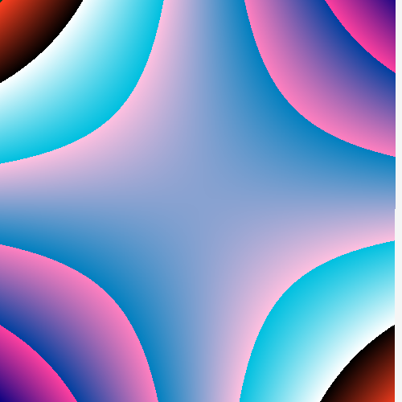

# CNF

Idea implementation from http://users.ece.cmu.edu/~adrian/projects/validation/validation.pdf 
Also would like to thank https://github.com/tsoding/ for streaming, Got me really inspired to do this as well.


(Generated using CNF)

## QUICK START

Dependencies

- [raylib](https://www.raylib.com/)

## USAGE

You can use CNF to generate 'Computer Generated Artwork'.
Basically the ```productions``` file have the Grammar in CNF.
It reads from it and produces a string which is then evaluated and then mapped to screen for every pixel giving us this art.

There are parts marked in as "TWEAKS" so that you can tweak the values and get different kinds of outputs.

Example:

```c
img_grid[i][j].c = (Color){
    .r = scaled * 10/2,
        .g = scaled * 10/8,
        .b = scaled * 10/16,
        .a = 255,
        // tweak's
        // You can multiply r, g, b with random values to get different colors
        // multiply with randf(start, end) to get distored pixel effect
};

```

Incase if you liked some image, then you can save the expression in the ```production_output2``` file and can read from it later.
You can also write an expression of your own in the ```production_output2```.
(Use the grammar correctly)

```c
    fp_output = fopen("./production_output", "r");
    // tweak's
    // Change ./production_output to ./production_output2 to parse a string that you have generated using the grammar.
```

### TO GENERATE STATIC OUTPUT

```console
$ gcc main.c -o main -lraylib -lm
$ ./main 10
```

<div style="display: flex; justify-content: space-around;">
  
  
</div>


### TO GENERATE FLOWING OUTPUT

```console
$ gcc main.c -o main -lraylib -lm
$ ./main 10 -f
$ ./main 10 -f2
$ ./main 10 -p
```

<div style="display: flex; justify-content: space-around;">
  
  
</div>

You can take screenshot of the image you like by pressing the 'S' key while the image is shown.
